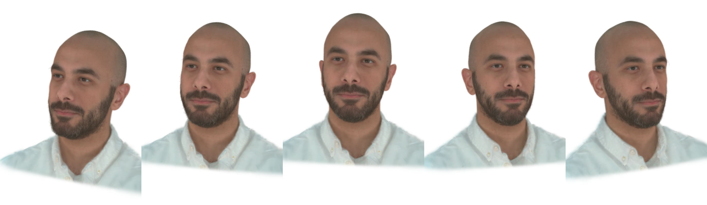
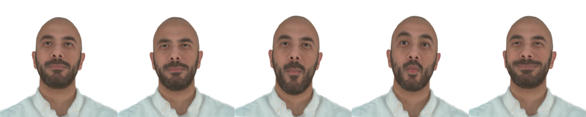
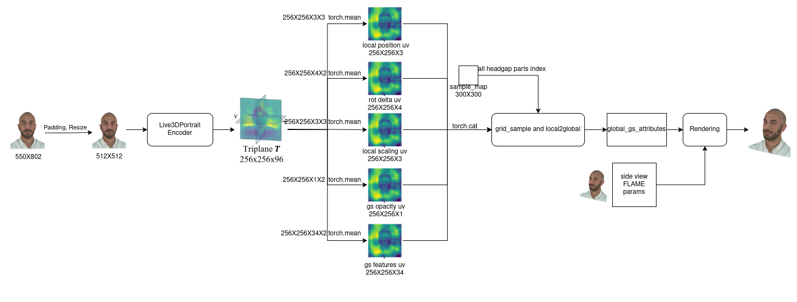

This repository demonstrates our work, One-Shot Head Avatars via Generalizable Gaussian Priors, which is a method that can create 3D facial avatars model by one-shot finetune.


## Experiment Results

<p style="text-align:center;">Demonstration result of our model</p>





<p style="text-align:center;">Pipeline of our method</p>

<p align="center">
  
</p>

## Installation

Clone our repository and create a conda environment to begin.
```
git clone https://github.com/Qyy2737242319/OSGAP && cd OSGAP
conda create --name OSGAP python=3.10
conda activate OSGAP
conda install -c "nvidia/label/cuda-11.8.0" cuda-toolkit ninja
ln -s "$CONDA_PREFIX/lib" "$CONDA_PREFIX/lib64"
conda env config vars set CUDA_HOME=$CONDA_PREFIX
conda deactivate
conda activate OSGAP
pip install torch==2.0.1+cu118 torchvision==0.15.2+cu118 --extra-index-url https://download.pytorch.org/whl/cu118
pip install -r requirements.txt
```

install differential gaussian rasterization with depth:

```
git clone --recurse-submodules https://github.com/slothfulxtx/diff-gaussian-rasterization.git 
cd diff-gaussian-rasterization
python setup.py install
```

Install segmentation_models_pytorch:

```
pip install -U git+https://github.com/qubvel/segmentation_models.pytorch
```

## Data Preparation

We use the original [NeRSemble Dataset](https://github.com/tobias-kirschstein/nersemble) and [NeRSemble Dataset V2](https://github.com/tobias-kirschstein/nersemble-data) to train and test our model.

[Optional] We use revised GaussianAvatars to generated gaussian attributes and convert them into uv maps as prior. Please clone our version [here](https://github.com/Qyy2737242319/GaussianAvatars) and create the environment.

Using the following command to train a basic GaussianAvatars model and generate uv maps. 

```
SUBJECT=218

python train.py \
-s data/UNION10_${SUBJECT}_EMO1234EXP234589_v16_DS2-0.5x_lmkSTAR_teethV3_SMOOTH_offsetS_whiteBg_maskBelowLine \
-m output/UNION10EMOEXP_${SUBJECT}_eval_600k \
--eval --bind_to_mesh --white_background --port 60000


SUBJECT=218

python render.py \
-m output/UNION10EMOEXP_${SUBJECT}_eval_600k \
--skip_train --skip_val \
--select_camera_id 8
```

You can find something like "gs_attrs_uv_300X300_*.npz" in "./output". We refer to it as uv_gt.


## Training and Viewing

First create list.txt under ./arguments which contains each id name used to train.

```
# list.txt structure
0
56
125
218
...
```

First, using the following command to train a OSGAP basic model, please see full parameter settings in arguments/\_\_init\_\_.py.

```
python train.py --data_path ./NerSamble/218/ --uv_gt_list_path ./uv/
```

For a test id, using the following command to finetune the encoder to get a better result:

```
python finetune.py --data_path ./NerSamble/218/ --uv_gt_path ./uv/218.npz
```

<details>
<summary><span style="font-weight: bold;">Command Line Arguments</span></summary>

  - `--data_path`
  The data path of NerSemble dataset.

  - `--uv_gt_path`
  The path of certain uv maps.

  - `--uv_gt_list_path`
  The path of uv maps directory.

</details>

Because our model structure is similar to GaussianAvatars, you can use their script to view the result of our model.

```
python local_viewer.py --point_path point_cloud.ply
```

<details>
<summary><span style="font-weight: bold;">Command Line Arguments</span></summary>

- `--point_path`

  Path to the gaussian splatting file (ply)

- `--motion_path`

  Path to the motion file (npz). You only need this if you want to load a different motion sequence than the original one for training.

</details>

## Todo

We are still working on this repository, thanks for your patience. 

- [x] Experiments demo of our method.
- [x] Tutorial for installation and data preparation.
- [x] Usage of training and viewing of results.
- [ ] Release the trained weight file.

## Weight File and Model

| Dataset          | Weight file and model                                                                                |
|------------------|------------------------------------------------------------------------------------------------------|
| NerSemble_id_218 | [OSGAP_single](https://drive.google.com/drive/folders/1kxKxAixX1Tl9eDfX-5JtS-kHlkapb_LQ?usp=sharing) |

## Acknowledgement

Our code is based on following repositories.

* [HeadGAP](https://headgap.github.io/)
* [GaussianAvatars](https://github.com/ShenhanQian/GaussianAvatars)
* [Live3DPortrait](https://github.com/Dong142857/Live3DPortrait)
